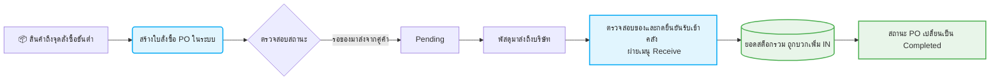
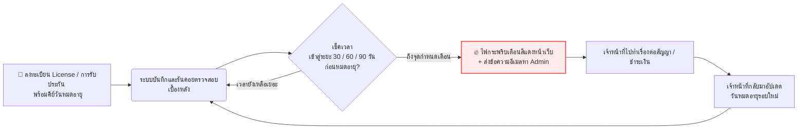

# 📌 โครงการระบบจัดการสินค้าคงคลัง IT (IT Stock Pro)

## 1. โปรเจกต์นี้คืออะไร?
**IT Stock Pro** คือ **"ระบบ Web Application สำหรับติดตาม จัดการ และควบคุมสินค้าคงคลังด้านอุปกรณ์และซอฟต์แวร์ไอทีแบบครบวงจร"** ถูกพัฒนาขึ้นมาภายใต้สถาปัตยกรรม Client-Server เพื่อใช้ทดแทนการจดบันทึกลงกระดาษหรือการนับสต็อกผ่านตาราง Excel แบบเดิม

## 2. ทำเพื่ออะไร? (วัตถุประสงค์หลัก)
*   **แก้ปัญหา Human Error:** ลดข้อบกพร่องจากการกรอกข้อมูลด้วยมือ (Manual) เปลี่ยนมาใช้การคำนวณแบบแยกประเภทบัญชี (Ledger Transaction) 
*   **Real-time Tracking:** รับรู้ยอดจำนวนและมูลค่าสต็อกในปัจจุบันทันทีที่มีการรับเข้า (Receive) หรือจ่ายออก (Dispense)
*   **ป้องกันสถานการณ์ Out of Stock:** มีระบบแจ้งเตือนเมื่อสินค้าน้อยกว่าจุดสั่งซื้อขั้นต่ำ (Min Stock) เพื่อให้ฝ่ายจัดซื้อดำเนินการก่อนที่อุปกรณ์จะหมด
*   **เพิ่มความรวดเร็ว:** สนับสนุนการใช้เครื่องสแกนบาร์โค้ดไร้สาย รวมไปถึงมีระบบ AI OCR ใช้อ่านตัวอักษรบนหน้าบิลเพื่อดึงชื่อคู่ค้าอัตโนมัติ 
*   **ควบคุมค่าใช้จ่ายเชิงป้องกัน:** มีฟังก์ชันติดตามการหมดอายุของลิขสิทธิ์ซอฟต์แวร์และการรับประกันอุปกรณ์ (MA & License Monitoring) ให้ไม่ขาดการต่อสัญญา

## 3. ผลลัพธ์ที่คาดหวัง (Expected Outcomes)
1.  **📊 Dashboard ความโปร่งใสแบบ 100%:** ผู้บริหารสามารถมอนิเตอร์มูลค่ารวมของคลัง และความเคลื่อนไหวต่างๆ ได้จากทุกที่ ทุกเวลา
2.  **🚀 กระบวนการเบิก-จ่ายรวดเร็ว:** เจ้าหน้าที่ IT ทราบตำแหน่งจัดเก็บ (Location) และสามารถกดจ่ายของออกจากคลังให้ผู้ใช้งานได้ภายในไม่กี่วินาที
3.  **⏳ ลดเวลาการตรวจนับ (Stock Audit):** จากเดิมที่ใช้เวลาทำรายงานสรุปหลายวัน จะลดลงเหลือแค่ไม่กี่ชั่วโมงพร้อมพิมพ์รายงายสรุปสินค้าสูญหายหรือเกิน
4.  **🔒 ความน่าเชื่อถือของข้อมูล:** สถาปัตยกรรมข้อมูลไม่เปิดช่องทางให้เข้าไปแก้ตัวเลขดิบแบบไร้ที่มา ทุกความเคลื่อนไหวสามารถทำการสอบกลับ (Audit Trail) ได้เสมอ

---

## 4. ฟีเจอร์หลักและการใช้งาน (Core Features)

ระบบได้ติดตั้งฟังก์ชันครอบคลุมการจัดการคลังพัสดุ โดยแบ่งออกเป็น 5 เมนูหลักดังนี้:

1.  **📊 Dashboard (แผงควบคุมหน้าแรก):** 
    *   สรุปมูลค่าสต็อกทั้งหมด (เงินทุนที่จมอยู่กับพัสดุ)
    *   กราฟแท่งเปรียบเทียบมูลค่าของแยกตามหมวดหมู่
    *   แจ้งเตือนสินค้าที่ถึงจุดสั่งซื้อ (Low Stock) และเปอร์เซ็นต์หมุนเวียนสินค้า
2.  **🚚 Purchase Orders & Receive (จุดสั่งซื้อและรับเข้า):**
    *   สร้างใบ PR/PO พร้อมจัดการสถานะว่ากำลังรอของหรือรับของแล้ว
    *   สามารถอัปโหลดรูปภาพใบเสร็จ/ใบส่งของ และใช้ **AI (OCR)** อ่านข้อความเพื่อช่วยค้นหาชื่อคู่ค้า (Vendor) ได้โดยอัตโนมัติ
3.  **📦 Inventory (คลังสินค้า):**
    *   หน้ารวมรายการสินค้าทั้งหมด สามารถค้นหาผ่านชื่อ, บาร์โค้ด หรือประเภท
    *   **กดยืม-คืน และเบิก-จ่าย:** ตัดยอดสต็อกด้วยปุ่มเดียวพร้อมกรอกเหตุผล
    *   ปุ่มสร้างและพิมพ์บาร์โค้ดสติกเกอร์ (QR/Barcode) ไปแปะที่กล่องจริงได้
4.  **⏱️ Stock Counting (กระบวนการตรวจนับ):**
    *   สร้างแคมเปญตรวจนับประจำสัปดาห์/เดือน
    *   รองรับการใช้มือถือหรือแท็บเล็ตเดินเช็คตามชั้นวาง เพื่อกระทบยอดจริงกับยอดในระบบ
5.  **📅 MA & License Management:**
    *   หน้าจอสำหรับเก็บสัญญาประกัน และวันหมดอายุซอฟต์แวร์
    *   มีไฟสถานะแดง/เหลือง/เขียว พร้อมป๊อปอัปแจ้งเตือนให้ไปต่ออายุก่อนระบบจะใช้ไม่ได้

---

## 5. โครงสร้างฐานข้อมูล (Database Structure)

ระบบเชื่อมต่อกับ **Microsoft SQL Server (MSSQL)** โดยใช้การเก็บข้อมูลแยกตาราง (RDBMS) ดังนี้:

**ตารางที่จัดการสิ่งของ (Master Data)**
*   `Stock_Products`: เก็บข้อมูลอุปกรณ์ ชื่อซีเรียล โมเดล ภาพ รูปแบบหน่วยนับ 
*   `Stock_Categories` / `Stock_Locations`: จัดหมวดหมู่ของพัสดุ และระบุตำแหน่งล็อคเกอร์

**ตารางหัวใจหลักของระบบบัญชีคลัง (Ledger)**
*   `Stock_Transactions`: เก็บข้อมูลความเคลื่อนไหว ไม่ว่าจะเป็นการเบิกจ่าย รับของ หรือลบยอด ทุกกระบวนการจะเกิด Transaction `IN` หรือ `OUT` เสมอ ห้ามแก้ยอดพาสดุใน DB โดยตรงเพื่อความปลอดภัย
*   `Stock_PurchaseOrders` / `Stock_PODetails`: ซีรีส์ในการเปิดใบสั่งซื้อและผูกไอเทมที่รอรับเข้า

**ตารางตรวจนับและติดตามการแจ้งเตือน (Tracking)**
*   `Stock_StockCountSessions` / `Stock_StockCountItems`: เก็บลิสต์รายการยอดเบิกและส่วนต่างระหว่างที่ลงพื้นที่นับมือ
*   `Stock_MALicense`: ติดตามวันเริ่มต้นและตารางวันหมดอายุการตั้งเตือนประกัน

---

## 6. โฟลว์กระบวนการระบบ (Process Flow)

Process Flow แสดงให้เห็นถึงเส้นทางการเชื่อมโยงและการส่งข้อมูลในระบบตั้งแต่ผู้ใช้ (Client) ไปจนถึงฐานข้อมูล (Database)

```mermaid
graph TD
    %% User Actions
    User((🧑‍💻 เจ้าหน้าที่ / Admin))
    
    %% Frontend Components
    subgraph Frontend [🌐 รูปแบบเว็บไซต์ (React JS)]
        UI[หน้าต่างแผงควบคุม / เมนูต่างๆ]
        Scanner[ระบบสแกนบาร์โค้ด / รูปภาพบิล]
    end
    
    %% Backend
    subgraph Backend [⚙️ เซิร์ฟเวอร์และตรรกะ (Node.js & Express)]
        API[API Router / Controllers]
        Scheduler[โปรแกรมตรวจสอบเวลาอัตโนมัติ]
    end
    
    %% Database
    subgraph DB [💾 ฐานข้อมูล (SQL Server)]
        Master[ข้อมูลหลัก<br/>(Products, Locations)]
        Trans[ข้อมูลเคลื่อนไหว<br/>(IN / OUT Ledger)]
        Orders[ข้อมูลสั่งซื้อ<br/>(PO / PR)]
    end
    
    %% External
    External[📧 ระบบอีเมลแจ้งเตือน]
    
    %% Connections
    User -->|กรอกข้อมูลเบิก-รับ/สแกน| UI
    User -->|สแกนภาพบิลเพื่อดึงข้อมูล| Scanner
    Scanner --> UI
    
    UI <-->|ส่งรีเควส HTTP (GET, POST)| API
    
    API <-->|อัปเดต / ดึงข้อมูล| Master
    API <-->|บันทึกการเคลือนไหวสต็อก| Trans
    API <-->|อัปเดตสถานะออเดอร์| Orders
    
    Scheduler -->|ตั้งเวลาตรวจสอบสินค้าน้อยกว่า Min Stock<br/>และ License ใกล้หมดอายุอัตโนมัติ| Master
    Scheduler -->|ทริกเกอร์| External
    External -.->|แจ้งเตือนกลับไปยัง Manager| User
```

---

## 7. กระบวนการปฏิบัติงานหลัก (Core Workflows)

### 7.1 กระบวนการสั่งซื้อและรับของเข้าคลัง (Purchase & Receive)
เป็นลูปการทำงานเมื่อพบว่าอุปกรณ์ใกล้หมดและมีการเติมของเข้าสู่ระบบ


### 7.2 กระบวนการเบิกจ่ายอุปกรณ์ (Dispense & Handover)
ลูปการทำงานเมื่อพนักงานเข้ามาขอเบิกของเพื่อนำไปใช้งาน
```mermaid
flowchart LR
    A[👤 พนักงานแจ้งขอเบิกอุปกรณ์ไอที] --> B(เจ้าหน้าที่เปิดหน้า Dashboard เบิกจ่าย);
    B --> C[เลือกอุปกรณ์ หรือ ยิงสแกนบาร์โค้ด <br/> ค้นหาแบบรวดเร็ว];
    C --> D[กรอกจำนวนและ ระบุชื่อผู้รับ/แผนก];
    D --> E[กดยืนยันการตัดคลัง];
    E --> F[(ยอดสต็อกรวม ถูกตัดออก OUT)];
    F --> G[เก็บบันทึกว่าใครเป็นคนเบิกและเวลาไหน <br/> (Transaction Log)];

    classDef action fill:#fff3e0,stroke:#ff9800,stroke-width:2px;
    classDef data fill:#feebea,stroke:#f44336,stroke-width:2px;
    class B,C,D,E action;
    class F,G data;
```

### 7.3 กระบวนการตรวจนับสต็อกประจำเดือน (Stock Audit)
ลูปการตรวจสอบจำนวนอุปกรณ์บนระบบให้ตรงกับในคลังที่มีจริง
```mermaid
flowchart TD
    A([เริ่มช่วงสิ้นเดือน / รอบตรวจนับ]) --> B(กดสร้างรอบสำรวจใหม่ในระบบ);
    B --> C[ถือ Tablet สแกนและกรอกจำนวนของ <br/> ที่มีอยู่จริงบนหน้าชั้นวาง];
    C --> D{พบส่วนต่างหรือไม่?};
    D -->|จำนวนจริง = จำนวนในระบบ| E[กดยืนยัน ปิดรอบตรวจนับสำเร็จ];
    D -->|จำนวนจริงไม่ตรงกับในระบบ <br/> (มีของเกิน หรือ ของสูญหาย)| F[ระบบขีดแดงไฮไลท์ <br/> ออกสรุปรายงานของที่ไม่ตรง];
    F --> G[ส่งเรื่องให้ผู้บริหารเซ็นอนุมัติรับรองส่วนต่าง];
    G --> H[ระบบลดยอด/เพิ่มยอดบัญชีอัตโนมัติ <br/> ให้ตรงกับปัจจุบัน (Adjust)];
    H --> E;
```

### 7.4 กระบวนการติดตามลิขสิทธิ์และประกัน (MA & License Monitoring)
ลูปการป้องกันปัญหาซอฟต์แวร์หมดอายุ

